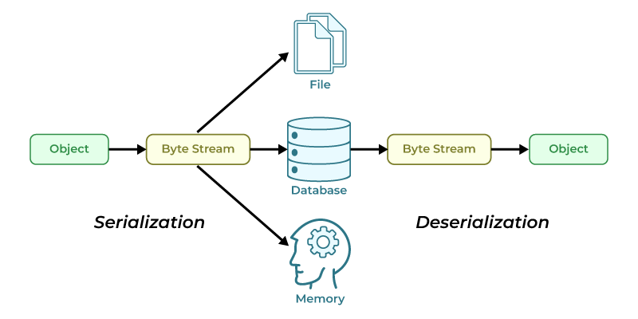
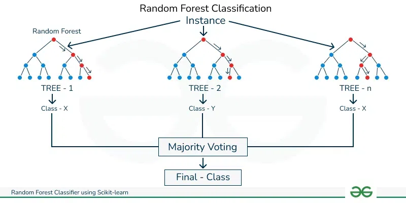

# Project Notes

## ASL Chart

## Pickle File
- Pickling is the process whereby a Python object hierarchy is converted into a byte stream, and unpickling is the inverse operation, whereby a byte stream (from a binary file or bytes-like object) is converted back into an object hierarchy.

## Random Forest Classification

### Benefits of Random Forest Classification
- Handles large datasets and high-dimensional data.
- Reduces the risk of overfitting by combining predictions from multiple decision trees.
- Robust to noisy data and works well with categorical data.

## Numpy Arrays
- **Data Type Consistency**: NumPy arrays store elements of the same data type, while Python lists can hold mixed data types.
- **Performance**: NumPy arrays are faster and optimized for numerical computations; Python lists are slower for mathematical operations.
- **Memory Efficiency**: NumPy arrays are more memory-efficient, especially for large datasets; Python lists have higher overhead.
- **Advanced Operations**: NumPy arrays support vectorized operations, broadcasting, and mathematical functions; Python lists lack these capabilities.
- **Use Cases**: Use NumPy arrays for scientific computing, data analysis, and large-scale numerical tasks; use Python lists for general-purpose programming or mixed data types.
